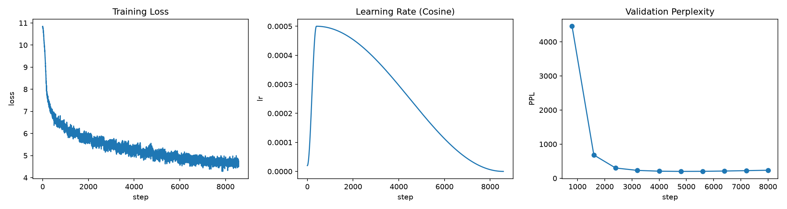

# Tiny Decoder-Only Language Model (from scratch)

A small decoder-only Transformer language model built from scratch in PyTorch, inspired by Stanford **CS336: Language Modeling from Scratch**. All core components are hand-implemented. Pre-trained on WikiText-2 and fine-tuned with SFT. Reproducible on a single consumer GPU (RTX 4060).

---

## ✨ Highlights

- **Hand-written core components**: RMSNorm, RoPE rotary positional embedding, Multi-Head Attention (with KV-cache), SwiGLU FFN, Weight Tying
- **KV-cache accelerated generation**: caches history K/V during autoregressive inference to avoid recomputation (verified identical to full computation)
- **Full training pipeline**: mixed-precision AMP, Cosine LR schedule + warmup, Weight decay (AdamW)
- **SFT fine-tuning**: fine-tuned on 100 instruction pairs, model learns `Question/Answer` format and generalizes to unseen instructions
- **Reproducible results**: WikiText-2 val perplexity reduced from random 50257 to **201.1** (16.8M model), with training curves and full ablation tables

---

## 📦 Requirements

- Python 3.11
- PyTorch 2.6+ (CUDA 12.x)
- NVIDIA GPU recommended (RTX 3060/4060+, 8GB VRAM)


## 🚀 步骤

### 1. Prepare data (first time)

The dataset is automatically downloaded and cached in `data/`.

```bash
#   train-00000-of-00001.parquet  ->  data/train.parquet
#   validation-00000-of-00001.parquet ->  data/validation.parquet
python src/data.py  # data pipeline self-test
```

### 2. Training

```bash
# Quick smoke test
python src/train.py --max_steps 30 --epochs 1 --batch_size 4 --seq_len 64 \
    --d_model 64 --n_heads 4 --n_layers 2 --d_ff 128

# Full training
python src/train.py --epochs 16 --batch_size 16 --seq_len 256 \
    --lr 5e-4 --warmup_steps 400 --grad_clip 1.0 \
    --dropout 0.2 --label_smoothing 0.1 --weight_decay 0.15 \
    --ema_decay 0.999 --tag myrun
```

Each run gets a timestamped directory:

- `checkpoints/run_<timestamp>_<config>/best.pt` — **best validation weights (recommended)**
- `checkpoints/run_<timestamp>_<config>/final.pt` — final weights
- `checkpoints/run_<timestamp>_<config>/step_*.pt` — per-eval checkpoints
- `outputs/run_<timestamp>_<config>/training_curves.png` — training curves

### 3. Evaluation & Generation

```bash
# Evaluate on validation (auto-loads latest best.pt)
python src/evaluate.py --split validation

# Generate with latest best.pt
python src/generate.py --prompt "The meaning of life is"

# Specify a model
python src/generate.py --ckpt checkpoints/run_xxx/best.pt --prompt "Once upon a time"

# Top-k sampling (more diverse)
python src/generate.py --prompt "Once upon a time" --top_k 50 --temperature 0.8
```

### 4. SFT Fine-tuning

```bash
# Generate instruction data (100 English Q&A)
python src/make_sft_data.py

# Fine-tune on pretrained best model (loss masking: only answer part gets loss)
python src/sft.py --pretrained checkpoints/best_model.pt --epochs 10 --lr 1e-4

# Test fine-tuned model
python src/generate.py --ckpt checkpoints/sft/run_xxx/sft_model.pt --prompt "Question: What is the capital of France?\nAnswer:" \
    --top_k 50 --temperature 0.7 --repetition_penalty 1.2
```

> Tip: use `--repetition_penalty 1.2` to suppress repetition loops in small models.

### 5. Run tests

```bash
python src/smoke_test.py   # model forward/backward/KV-cache consistency
python src/data.py         # data pipeline self-test
```

## 📊 Results

This project contains **two tracks of experiments**:

| Track | Model | Purpose | Status |
|---|---|---|---|
| **Principle Tests** (Part 1) | 16.8M (d256) | Verify training principles: ablation, scaling, SFT | ✅ Complete |
| **GPU Limit Test** (Part 2) | 177M (d1024) | Push this GPU to its limit, best config only | 🔄 Running |

---

### Part 1: Principle Tests (16.8M)

#### Best Config

| Metric | Value |
|---|---|
| Params | 16.8M (d256) |
| Vocab (BPE) | 50,257 |
| Train tokens | 2.2M |
| Val tokens | 238K |
| Best train loss | ~4.69 |
| **Best Val Perplexity** | **201.1** (best.pt; random init = 50257) |
| Device | RTX 4060 Laptop (8GB) |

#### Training Curves (16ep baseline)



#### Ablation (one component at a time)

Baseline: `16ep, bs16, seq256, lr5e-4, warm400, gradclip, EMA0.999, dropout0.2, label_smoothing0.1, wd0.15`

| # | Experiment | Change | PPL | ΔPPL |
|---|---|---|---|---|
| 1 | **Baseline** | — | **201.1** | — |
| 2 | no EMA | `ema_decay=0` | 212.4 | +11.3 |
| 3 | no label smoothing | `label_smoothing=0` | 213.3 | +12.2 |
| 4 | lower dropout | `dropout=0.1` | 203.6 | +2.4 |
| 5 | no regularization | dropout0.1 + LS0 + wd0.1 | 207.8 | +6.6 |

> **Ablation findings**:
> - **EMA contributes most** (+11.3 PPL): smooths weights for better generalization.
> - **label smoothing next** (+12.2 PPL): suppresses overfitting.
> - **dropout alone small** (+2.4 PPL), but effective when combined with other regularization.
> - contributions are roughly additive.

#### Capacity Ablation (model width, 16 epoch)

| d_model | n_layers | Params | best PPL |
|---|---|---|---|
| 128 | 4 | 7.1M | 261.1 |
| 256 | 6 | 16.8M | 201.1 |
| 512 | 6 | 41.5M | **183.2** |

> **Capacity finding**: more params → lower PPL. Observed *performance gain with increased model capacity on small corpus*. Larger model (177M d1024) is explored in Part 2.

#### Head Count Ablation (same capacity 16.8M)

| n_heads | head_dim | best PPL |
|---|---|---|
| 4 | 64 | 202.4 |
| 8 | 32 | **201.1** |
| 16 | 16 | 201.3 |

> **Head finding**: head count barely affects PPL (201~202) at same capacity; 8 heads is sufficient.

#### Optimization Journey (from scratch to best)

| # | Config | PPL | Note |
|---|---|---|---|
| 1 | 3ep, bs8, seq256, lr3e-4 | 343.6 | baseline |
| 2 | 3ep, bs8, **seq512** | 393.7 | longer seq worse |
| 3 | 6ep, bs16, lr3e-4 | 287.0 | more training |
| 4 | 6ep, bs16, doc concat | 320.2 | not helpful |
| 5 | 6ep, bs16, **lr5e-4** + warm400 + gradclip | 242.6 | higher lr |
| 6 | 10ep, + **EMA** | 226.7 | EMA smoothing |
| 7 | 10ep, + **regularization** | 213.9 | anti-overfit |
| 8 | 16ep + reg + **best.pt** | **201.1** | **best** |

> **Optimization findings**:
> 1. **training amount > seq length**: more epochs/batch beats longer sequences on small data.
> 2. **lr + warmup + grad clip**: lr 3e-4→5e-4 combo dropped PPL 287→242.6.
> 3. **best.pt mechanism**: saves best val weights, avoiding late-overfitting weights hiding the true optimum.

#### Supervised Fine-Tuning

Fine-tune on 100 hand-made English Q&A pairs (geography/history/science/biology) to learn the `Question/Answer` format.

**Core: loss masking** — only the `Answer` part gets loss (the question is input, not to be predicted).

##### Before vs After (16.8M model)

| Input | Before | After |
|---|---|---|
| `Question: What is the capital of France?` | meaningless continuation `"the most great @-@ great..."` | `The capital of France is Paris.` ✅ |
| `Question: What is the capital of Germany?` (unseen) | — | `The capital of Germany is Paris.` (format correct, content hallucination) |

> SFT makes the model answer in Q&A format, and the format **generalizes to unseen instructions**.
> Content hallucination due to limited data — normal for small models.

##### SFT loss & overfitting (16.8M)

| Model | SFT loss (10ep) | Unseen Q |
|---|---|---|
| 16.8M | 1.39 | format correct |

> **Observation**: SFT loss can be driven very low (memorizing training data) without improving unseen questions. **Lower SFT loss ≠ better generalization**; 10 epochs is enough for format learning.

#### Generation Samples (PPL 201 best model)

---

### Part 2: GPU Limit Test (177M d1024)

Pushing the RTX 4060 Laptop (8GB) to its limit with the largest model it can train.

| Metric | Value |
|---|---|
| Params | 177.3M |
| Config | d_model=1024, n_heads=16, n_layers=12, d_ff=2048 |
| VRAM usage | ~7.3 GB / 8 GB |
| Training | 16 epochs, batch=8, seq=256 |
| **Best Val Perplexity** | *pending...* |

> Training in progress (~10 hours). Results will be filled in when complete.

```
> The meaning of life is
 The meaning of life is a species which can be used as a variety of
 different species . The species has been described by the species .

> In the beginning
 In the beginning of this period , Wheeler played a role with the club
 in a British professional football game , a professional club record
 of four matches . In 2008 , he signed with the First Division Player
 of the Year to a 2 – 1 lead in a five @-@ year contract . In early
 2013 , he was named the league 's highest appearance in the Division
 I 'll be known for the Conference , which would be
```

> The 17M model produces grammatically correct English (subordinate clauses, years), with repetition and nonsense content — normal for small models.

## 📁 Project Structure

```
├── src/
│   ├── model.py         # Decoder-Only Transformer (core)
│   ├── tokenizer.py     # BPE tokenizer (GPT-2 style ByteLevel)
│   ├── data.py          # WikiText-2 data pipeline
│   ├── train.py         # pretraining (AMP + cosine LR + EMA + best.pt)
│   ├── generate.py      # KV-cache generation (greedy / top-k / repetition penalty)
│   ├── evaluate.py      # PPL evaluation
│   ├── sft.py           # SFT fine-tuning (loss masking)
│   ├── make_sft_data.py # SFT instruction data generation
│   ├── smoke_test.py    # model correctness smoke tests
├── assets/              # training curves (referenced by README)
├── data/                # dataset + tokenizer + SFT data (gitignore)
├── checkpoints/         # model weights, per-run directories (gitignore)
├── outputs/             # training curves, matching checkpoints (gitignore)
└── requirements.txt
```

> Each training run creates an independent `run_<timestamp>_<seq>seq_<epochs>ep` directory for easy experiment comparison.

## 📚 Technical Highlights

- **RoPE**: rotary positional encoding via q/k rotation, no extra params, supports longer sequences
- **Pre-Norm + Residual**: more stable gradients
- **Weight Tying**: shared input/output embedding, halves params, faster convergence
- **KV-cache**: generation complexity from O(N²) to O(N)
- **AMP mixed precision**: fp16 compute + fp32 master weights
- **EMA**: weight moving average, better generalization
- **Regularization combo**: dropout 0.2 + label smoothing 0.1 + weight_decay 0.15
- **best.pt mechanism**: saves best val weights, avoids late-overfitting

## 🙏 References

- [CS336: Language Modeling from Scratch](https://stanford-cs336.github.io/)
- [minGPT (Andrej Karpathy)](https://github.com/karpathy/minGPT)
- [GPT-2 (Radford et al.)](https://openai.com/research/language-unsupervised)
